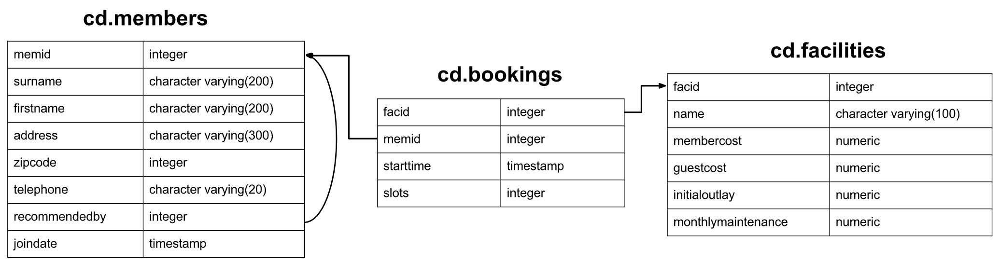

### Overview

This repository contains my answers to exercises on PostgreSQL from https://pgexercises.com . 
Each folder coresponds to one of seven charapters and contains files with answers to exercises. 
Each file has one implemented query for each exercise.

### Content

- [Basic](basic/) - this chapter covers basic SQL queris and expressions.
- [Joins and subqueries](joins_and_subqueries/) - this chapter covers different types of joins and subqueries.
- [Modifying date](modifying_data/) - this chapter deals with inserting, updating and delating queris.
- [Aggregation](aggregates/) - this chapter covers standart aggregations along with window functions.
- [Date](date/) - this chapter covers Date/Time functionality in PostgreSQL.
- [String](string/) - this chapter covers PostgreSQL string functionality and use of regular expressions.
- [Recursive](recursive/) - this chapter covers recursive queries on graph-structured data.

### Schema

Below is a schema that describes a DB used in the exercises.

### Source of exercises

https://pgexercises.com
